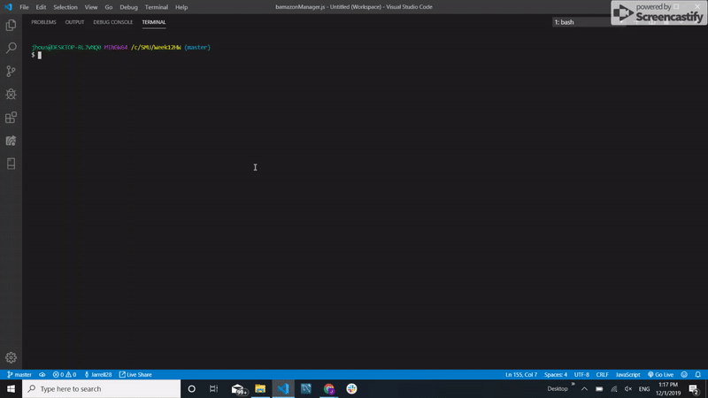

<h1>BAMAZON</h1>

This is a CLI application that allows customers to purchase available products, and managers to add new products, view low stock products, view all products and increase stock to products. There are two separate commands to run in node to get the app going.

<h2>Bamazon Customer</h2>

<b>Run Command:</b> node bamazonCustomer.js

<h2>Bamazon Manager</h2>

<b>Run Command:</b> node bamazonManager.js

